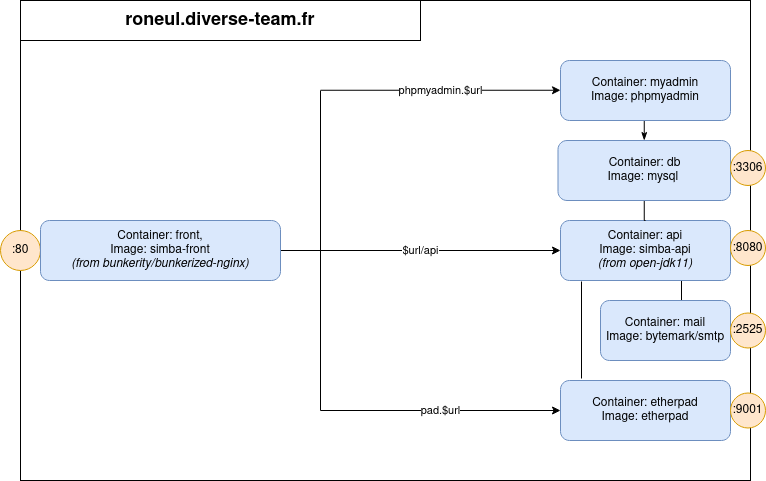

# Doodle student

## Notes

Puisque nous n'avons pas pleinement la main sur la configuration du nom de domaine, les front d'etherpad et phpmyadmin ne sont pas accessibles.
Néanmoins la configuration nginx est faite comme si nous pouvions correctement configurer la redirection, les urls complètent seraient alors :
  | URL | service |
  | -- | -- |
  roneul.diverse-team.fr | Front
  pad.roneul.diverse-team.fr | Etherpad
  phpmyadmin.diverse-team.fr | PHPMyAdmin
  
En l'état, seule la première fonctionne.

## Déploiement
Sur la vm, ou en local :
```bash
# docker build -t simba-front ./front
docker build -t simba-api ./api
docker-compose up --build
```
Le front est alors accessible sur le port 80.
## Diagramme de déploiement

